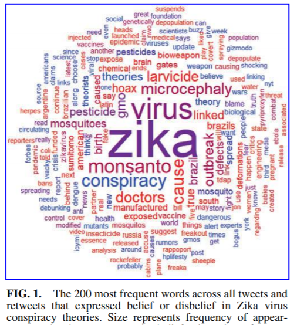

```{r setup, include=FALSE}
## Save package names as a vector of strings
pkgs <-
  c("rmarkdown",
    "knitr",
    "dplyr",
    "devtools",
    "widgetframe",
    "RefManageR",
    "bibtex",
    "plotly",
    "xaringan")

## Install uninstalled packages
lapply(pkgs[!(pkgs %in% installed.packages())], install.packages)

## Load all packages to library and adjust options
lapply(pkgs, library, character.only = TRUE)

## Devtools install
#if (!("icon" %in% installed.packages()))
 # devtools::install_github("ropenscilabs/icon")
#library(icon)

## Global chunk options
knitr::opts_chunk$set(echo = FALSE,
                      warning = FALSE,
                      message = FALSE)
options(scipen=999)
options(htmltools.dir.version = FALSE)

## RefManageR options
BibOptions(
  bib.style = "authoryear",
  hyperlink = "to.bib",
  style = "markdown",
  max.names = 3L
)
```

# Text as Data

- Text Data for Social Scientists:

  - open ended survey responses, social media data, interview transcripts, electronic health records, news articles, official documents (laws, regulations, etc.), research publications, digital trace data

- even if data of interest does not exist in textual form (yet): tools of speech recognition and machine translation, crowdworkers, etc.

- *previously*: text data was often ignored, selectively read and used anecdotally or manually labeled
 
- *now*: wide variety of text analytical methods (supervised + unsupervised) and increasing adoption of these methods from social scientists

---
# Text as Data

```{r, fig.show="hold", out.width = "30%", fig.cap=''}



```

.footnote[<font size="3"><br>Sources from left to right: [Santos, Paulos & Guerreiro 2018](https://www.emerald.com/insight/content/doi/10.1108/IJEM-01-2017-0027/full/pdf?casa_token=4vYq-zNmJFkAAAAA:ncpw7fsdg97gbyLTPGxZVQSJ_GpdaLcyaWNo_r4DaNFRvijwBW5NRPpyV8u2SiNpBQRru04jVUhyO3imrfEK5kMtOM4nS5A4WtuGbBvr1-v1-Mrfxk48RQ);
[Mostafa, M. 2018](https://journals.sagepub.com/doi/pdf/10.1177/1470785318771451);
[Wood, M. 2018](https://www.liebertpub.com/doi/pdfplus/10.1089/cyber.2017.0669)</font size>] 

---
# Text as Data

```{r, fig.show="hold", out.width = "50%", fig.cap=''}


```

.footnote[<font size="3"><br>Source: [Mostafa, M. 2018](https://journals.sagepub.com/doi/pdf/10.1177/1470785318771451)</font size>] 

---
# Language in NLP

.gold[corpus]: a collection of documents

.gold[documents]: single tweets, single statements, single text files, etc.

.gold[tokenization]: refers to defining the unit of analysis, e.g., single words, sequences of words or entire sentences (referred to as .gold[tokens])

.gold[bag of words (method)]: approach where all tokens are put together in a “bag” without considering their order (alternatively: .gold[bigrams (word pairs), word embeddings]) 
- possible issues with a simple bag-of-word: “I’m not *happy* and I don’t *like* it!”
  
.gold[stop words]: very common but uninformative terms such as “the”, “and”, “they”, etc.

.gold[document-term/feature matrix (DTM/DFM)]: common format to store text data (more later on)

---
# A typical (R-) Workflow for Text Analysis

1. Retrieve data / data collection

2. Data manipulation / Corpus pre-processing

3. Vectorization (DTM/DFM)

4. Analysis

5. Validation and Model Selection

6. Visualization and Model Interpretation

---
# 1. Data collection

- use existing corpora 
  - R: {gutenbergr}: contains more than 60k book transcripts 
  - R: {quanteda.corpora}: [multiple inherit corpora](https://github.com/quanteda/quanteda.corpora)
  - R: {topicmodels}: contains Associated Press data (2246 news articles mostly from around 1988)
  - search for datasets, see e.g. [this list](https://docs.google.com/spreadsheets/d/1I7cvuCBQxosQK2evTcdL3qtglaEPc0WFEs6rZMx-xiE/edit#gid=0)
  
- collect new corpora
  - electronic sources (APIs, Web Scraping), e.g. Twitter, Wikipedia, [transcripts of all german electoral programs](https://www.bundestagswahl-2021.de/wahlprogramme/)
  - undigitized text, e.g. scans of documents
  - data from  interviews, surveys and/or experiments

- consider relevant applications to turn your data into text format (speech-to-text recognition ([google API](https://cloud.google.com/speech-to-text)), [pdf-to-text](https://en.wikipedia.org/wiki/Pdftotext), [OCR](https://en.wikipedia.org/wiki/Optical_character_recognition#:~:text=Optical%20character%20recognition%20or%20optical,billboards%20in%20a%20landscape%20photo)))

---
# 2. Data manipulation

- text data is different from “structured” data (e.g., a set of rows and columns)

- most often not “clean” but rather messy
  - shortcuts, dialect, wrong grammar, missing words, spelling issues, ambiguous language, humor
  - web context: emoticons, #, etc.

- Investing some time in carefully cleaning and preparing your data might be one of the most crucial determinants for a successful text analysis!

---
# 2. Data manipulation

Common steps in pre-processing text data:
  - stemming
    - computation, computational, computer $\rightarrow$ compute
  - lemmatization
    - "good" $\rightarrow$ "better"
  - transformation to lower cases
  - removal of punctuation (,;.-) / numbers / white spaces / URLs / stopwords

$\rightarrow$ Always choose your prepping steps carefully! 

For instance removing punctuation might be a good idea in almost all projects, however think of unhappy cases: “Let’s eat, Grandpa” vs. “Lets eat Grandpa.”
- unit of analysis! (sentence vs. unigram)

---
# 2. Data manipulation

- In principle, all those transformations can be achieved by using base R

- Other packages however provide ready-to-apply functions, such as [{tidytext}](https://cran.r-project.org/web/packages/tidytext/index.html), [{tm}](https://cran.r-project.org/web/packages/tm/index.html), [{quanteda}](https://cran.r-project.org/web/packages/quanteda/index.html) 
  - each with its own advantages and shortcomings (examples on the next slides)

- **Important**: to start pre-processing with this packages your data always has to be first transformed to a **corpus object** or alternatively to a **tidy text object** (*examples on the next slides*)

---
# 2. Data manipulation: tidytext Example

Pre-processing with {tidytext} requires a tidy text object:
  - one-token-per-row
  - “long format"

```{r}
library(quanteda)
library(quanteda.corpora)
library(dplyr)
```

First have a look at the original data ([collection of guardian articles](https://github.com/quanteda/quanteda.corpora), n=20):

```{r, results="raw"}
guardian_corpus <- quanteda.corpora::download("data_corpus_guardian")

text <- guardian_corpus[["documents"]][["texts"]]
df <- as.data.frame(text)

text <- df[1:20,]
df <- as.data.frame(text)
df <- tibble::rowid_to_column(df, "ID")

str(df,5)
dim(df)
```

.gold[Q: Can you describe the above dataset? How many variables and observations are there? What do the variables display?]

---
# 2. Data manipulation: tidytext Example

<font size="4"> - by using the unnest_tokens() function we transform the original data to a tidy text format

.gold[Q: How does our dataset change after tokenization and removing stopwords? How many observations do we now have? And what does the ID variable identify/store?]


```{r, echo=TRUE, results="raw"}
# Load the tidytext package
library(tidytext)

# Create tidy text format and remove stopwords
tidy_df <- df %>%
  unnest_tokens(word, text) %>% 
  anti_join(stop_words) 

str(tidy_df,5)
dim(tidy_df)
```
</font size>

---
# 2. Data manipulation: tidytext Example

+: tidytext removes punctuation and makes all words lowercase automatically

-: all other transformations need some dealing with [regular expressions](https://cbail.github.io/SICSS_Basic_Text_Analysis.html) (gsub, grep, etc.) $\rightarrow$ consider alternative packages (examples on the next slides)

  - Example to remove white space with tidytext (s+ describes a blank space)

```{r, eval=F, echo=T}
tidy_df$word <- gsub("\\s+","",tidy_df$word)
```

+: with the tidy text format, regular R functions can be used instead of the specialized functions necessary to analyze a corpus object

  - dplyr example to count the most popular words in your texts
  
```{r, eval=F, echo=T}
tidy_df %>% count(word) %>% arrange(desc(n))
```
  
---
# 2. Data manipulation: tm Example

- Input data is not a tidy text object but a corpus object
  - corpus in R: group of documents with associated metadata
  
```{r, echo=T, results="raw"}
# Load the tm package
library(tm)

# Create a corpus
corpus <- VCorpus(VectorSource(df$text))
corpus
```

```{r, out.width = "70%", fig.align='center', fig.cap=''}
knitr::include_graphics("corpus_1_tm.PNG")
```
---
# 2. Data manipulation: tm Example

- tm_map() functions can be applied to a whole corpus

```{r, echo=T, results="raw"}
# Clean corpus
corpus_clean <- corpus %>%
  tm_map(removePunctuation, preserve_intra_word_dashes = TRUE) %>%
  tm_map(removeNumbers) %>% 
  tm_map(content_transformer(tolower)) %>% 
  tm_map(removeWords, words = c(stopwords("en"))) %>% 
  tm_map(stripWhitespace) %>% 
  tm_map(stemDocument)
```

```{r, out.width = "70%", fig.align='center', fig.cap=''}

```

---
# 2. Data manipulation: quanteda Example

- Input data again is a corpus object

```{r, echo=T}
# Load quanteda package
library(quanteda)

# Store data in a corpus object
corpus <- corpus(df$text)
```

```{r, out.width = "50%", fig.align='center', fig.cap=''}
knitr::include_graphics("corpus_1_quanteda.PNG")
```

---
# 2. Data manipulation: quanteda Example

- quanteda combines prepping and dfm-transformation in one step (see next slides on vectorization for more information)

```{r, echo=T}
dfm <- dfm(corpus,
            stem = TRUE,
            tolower = TRUE,
            remove_twitter = FALSE,
            remove_punct = TRUE,
            remove_url = FALSE,
            remove_numbers =TRUE,
            verbose = TRUE,
            remove = stopwords('english'))
```

```{r, out.width = "70%", fig.align='center', fig.cap=''}
knitr::include_graphics("corpus_2_quanteda.PNG")
```
---
# 2. Data manipulation: Summary

- R (as usual) offers many ways to achieve similar or same results

- To start with, I would choose one package you feel comfortable with and go with it.. you will soon get a grasp for your data (and textual data in general) with advantages and disadvantages of different packages :-)

---

# 3. Vectorization: Turning Text into a Matrix

- Text analytical models (e.g., topic models) often require certain your data to be stored in a special format
  - only so will algorithms be able to quickly compare one document to a lot of other documents to identify patterns

- Typically: **document-term matrix (DTM)**, sometimes also called **document-feature matrix (DFM)**
  - matrix with each row being a document and each word being a column
    - term-frequency (tf): The number within each cell describes the number of times the word appears in the document
    - term frequency–inverse document frequency (tf-idf): weights the occurence of certain words, e.g., lowering the weight of the word “social” in an corpus of sociological articles
    
???

td-idf: how often a word appears in a local context (such as a document) with how much it appears overall in the document collection

---
# 3. Vectorization: tidytext example

<font size="3">Remember our tidy text formatted data (one-token-per-row)?

```{r, out.width = "10%", fig.align="center", fig.cap=''}

```

```{r, echo=T, eval=T}
# Cast tidy text data into DTM format
dtm <- tidy_df %>% 
  count(ID,word) %>%
  cast_dtm(document=ID,
                 term=word,
                 value=n) %>%
        as.matrix()
dim(dtm)
```

```{r, out.width = "40%", fig.cap=''}
knitr::include_graphics("tidytext_2.PNG")
```
</font size>

---
# 3. Vectorization: tm example

<font size="4">
- In case you pre-processed your data with {tm}, remember we ended with a cleaned corpus object
- Now, simply put your corpus object into the DocumentTermMatrix function of the tm-package  

```{r, echo=T, out.width="50%"}
dtm_tm <- DocumentTermMatrix(corpus_clean, control = list(wordLengths = c(2, Inf))) # control argument here is specified to include words that are at least two characters long

inspect(dtm_tm[1:3,3:8])
```

- for quanteda example: look at the previous slide with the quanteda example ;-)
</font size>
---

# A typical (R-) Workflow for Text Analysis

1. Retrieve data / data collection

2. Data manipulation / Corpus pre-processing

3. Vectorization (DTM/DFM)

4. **Analysis**

5. **Validation and Model Selection** ( $\rightarrow$ “lab”)

6. **Visualization and Model Interpretation** ( $\rightarrow$ "lab”)

---
# 4. Analysis: Unsupervised text classification

```{r, out.width = "70%", fig.align='center', fig.cap=''}

```

.footnote[<font size="3"><br>Source: [Christine Doig 2015](http://chdoig.github.io/pygotham-topic-modeling/#/2/1)</font size>] 
---
# 4. Analysis: Topic Models

<font size="4">Aim: 
- discovering the hidden (i.e, latent) topics within the documents and assigning each of the topics to the documents
- topic modeling: entirely unsupervised classification
  - $\rightarrow$ no prior knowledge of your corpus or possible latent topics is needed (however some knowledge might help you validate your model later on) 
- Researcher only needs to specify number of topics (not as intuitive as it sounds!)</font size>

```{r, out.width = "40%", fig.align='left', fig.cap=''}

```
.footnote[<font size="3"><br>Source: [Christine Doig 2015](http://chdoig.github.io/pygotham-topic-modeling/#/2/6)</font size>]


---
# 4. Analysis: Latent Dirichlet Allocation (LDA)

- one of the most popular topic model algorithms
- developed by a team of computer linguists (David Blei, Andrew Ng und Michael Jordan, [original paper](https://www.jmlr.org/papers/volume3/blei03a/blei03a.pdf)) 

- two assumptions:

  - 1) each document is a mixture over latent topics
      - For example, in a two-topic model we could say “Document 1 is 90% topic A and 10% topic B, while Document 2 is 30% topic A and 70% topic B.”
      
  - 2) each topic is a mixture of words (with possible overlap)

---
# 4. Analysis: Latent Dirichlet Allocation (LDA)

```{r, out.width = "40%", fig.align='center', fig.cap=''}
knitr::include_graphics("topic-models-Blei.PNG")
```

.footnote[<font size="3"><br>Source: [Blei, Ng, Jordan (2003)](https://www.jmlr.org/papers/volume3/blei03a/blei03a.pdf)</font size>] 
---
# 4. Analysis: Latent Dirichlet Allocation

<font size="4.5">
1) specify number of topics (*k*)

2) each word (*w*) in each document (*d*) is randomly assigned to one topic (assignment involves a [Dirichlet distribution](https://en.wikipedia.org/wiki/Dirichlet_distribution)) 
  
3) these topic assignments for each word *w* are then updated in an iterative fashion ([Gibbs Sampler](https://medium.com/analytics-vidhya/topic-modeling-using-lda-and-gibbs-sampling-explained-49d49b3d1045)) 
  - namely: again, for each word in each document two probabilities are repeatedly calculated:
    - a) “document”-level: proportion of words in document *d* belonging to a certain topic *t* (beta) -> relative importance of topics in documents
    - b) “word”-level: proportion of words being assigned to a certain topic *t* in all other documents (gamma) -> relative importance of words in topics
  - each word is reassigned to a new topic which is chosen as the probability of *p = beta x gamma* (-> overall probability that a certian topic generated the respective word *w*, put differently: overall probability that that *w* belongs to topic 1, 2, 3 or 4 (if *k* was set to 4)

4) Assignment stops after user-specified threshold,	or when iterations begin to have little impact on	the probabilities	assigned to words in	the corpus</font size> 

---
# 4. Analysis: Structural Topic Models

- Structural Topic Models (STM) employs main ideas of LDA but adds a couple more features on top^
  - e.g., STM recognizes if topics might be related to one another (e.g., if document 1 contains topic *A* it might be very likely that it also contains topic *B*, but not topic *C* - Correlated Topic Model) 
  
- especially useful for social scientists who are interested in modeling effects of covariates (e.g., year, author, sociodemographics, time as a covariate, source)

- generally, by allowing to include such metadata STM exceeds a simple bag-of-words approach

.footnote[<font size="3"><br>^for an detailed explanation of differences between LDA and STM, read [here](https://towardsdatascience.com/introduction-to-the-structural-topic-model-stm-34ec4bd5383#:~:text=If%20you%20are%20interested%20in,a%20couple%20different%20algorithms%20(the)]

---

class: center, middle

# STM Example: 
Whose ideas are worth spreading? The representation of women and ethnic groups in TED talks

---
# STM Example

- Carsten Schwemmer & Sebastian Jungkunz (2019)
- original paper: https://www.tandfonline.com/doi/full/10.1080/2474736X.2019.1646102
- replication files: https://dataverse.harvard.edu/dataset.xhtml?persistentId=doi:10.7910/DVN/EUDWP3

**Research Questions**: 

How are women and different ethnic groups represented in TED Talks?
Which topics do TED Talks generally cover? Which topics are covered by women and different ethnic groups? Do different topics / speakers lead to different sentiment (ratings)?

**Data**:

- transcripts of over 2333 TED talks from the TED Website
- facial recognition API: characteristics of speakers, e.g., gender and ethnicity
- Youtube Data API: YT metadata, e.g., likes, comments and views

---

class: center, middle

#Example: Structural Topic Model

https://clandesv.github.io/ted-talks-STM/stm_replication.html

